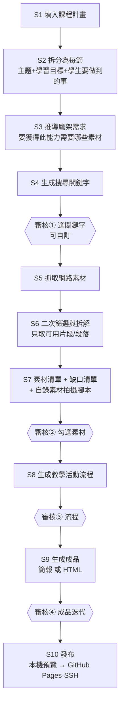

# 工作流程規範（從課程計畫到成品教材）

> 另外三份規範談「**怎麼設計**」（引導邏輯、簡報、HTML）；**這份談「怎麼跑」**——
> 從一份課程計畫出發，一路走到可上課的簡報或 HTML 互動教材的自動化流程。
>
> **三條總原則**
> 1. **全程以課程計畫為依據**：每個階段的生成指令都必須先讀取課程計畫對應段落，不得憑空發揮。
> 2. **每階段產出「文件」**：不是把結果留在對話裡，而是寫成檔案落地，可回溯、可重跑、可版本比較。
> 3. **介面唯讀、修改在對話**：視覺工作台只負責讀取與展示；所有勾選、修改、討論都在 Claude Code 進行。

---

## 1. 流程總覽（9 階段 · 4 個審核點）



**節次選取**：S2 產出整學期 20 節總表後，**可一次指定多節**（例如「跑第 5、6、7 節」）批次走 S3–S9。

---

## 2. 檔案與資料夾約定

每一節一個工作資料夾，階段產出依序編號落地——**檔名即流程進度**。

```
materials/
└── g5-智慧交通避障/
    ├── 00_節次總表.md                  # S2：整學期 20 節
    └── L05_地圖街景找障礙/
        ├── 01_目標與鷹架.md            # S3
        ├── 02_搜尋關鍵字.md            # S4 → 審核①
        ├── 03_素材候選.md              # S5–S6（原始抓取與拆解結果）
        ├── 04_素材清單與缺口.md         # S7 → 審核②（含拍攝腳本）
        ├── 05_教學活動流程.md           # S8 → 審核③
        ├── 五上_L05_地圖街景找障礙.html # S9 → 審核④（命名見下方「成品檔名規範」）
        └── assets/
            ├── (下載的圖片與教學資源)
            └── 來源清單.md              # 每個素材的出處與授權標記
```

**`L##` 的編號＝第幾週上這節課，不是隨手流水號**（2026-09-10 起成為硬性契約）。下游有兩個工具直接依賴它，編錯就對不起來：

| 依賴的地方 | 怎麼用 |
|---|---|
| 工作台「發布到 Classroom」→ 類型選「問題」 | 自動帶出標題 `第{X}週 {單元名稱}`，X 就是資料夾的 `L##` |
| 評分平台「回寫 Classroom」 | 從學習單網址／id 的 `L##` 反推週次，去該課程找標題「第X週…」開頭的作業，把成績寫進去 |

- 所以**跳週、補課、調課時要一起把資料夾編號想清楚**：如果第 7 週實際上的是 `L05`，Classroom 的簽到題標題會是「第5週…」，回寫也會照 5 走——只要**兩邊一致**就不會出錯，會出錯的是「資料夾照順序編、Classroom 標題照日曆手改」這種各編各的。
- 真的必須脫鉤時（例如同一週上兩節），回寫畫面可以手動改選作業，但**預設比對就會失準**，屬於已知代價。

---

## 3. 逐階段規格

### S1　填入課程計畫
- **輸入**：課程計畫（`.docx`，如現有的彈性學習課程計畫）或貼上的文字。
- **要求**：解析出 專題名稱／驅動問題／課程目標／表現任務／6P 脈絡／逐週的「單元問題・學習內容・學習目標・學習活動・單元任務・學習資源」。
- **注意**：計畫是骨架，實際教學會偏移（例如原訂硬體單元未實施）。若已知落差，在此階段就標註，後續一律以**實際要教的**為準。

#### S1.1　核對既有教學證據（務必做，不可只讀計畫就動筆）
> **教訓來源**：曾發生只依課程計畫拆節，結果漏掉「環境建置」（Classroom/帳號/簽到）與「AI 生成 HTML 網站」兩個**計畫外但實際教過**的單元——而後者還是先前分析時自己標註過的重點落差。**計畫是骨架，真正的教學設計活在課堂裡**；只讀計畫等於重蹈覆轍。

- **動筆前先查**：這個專題／年級是否已有**既有簡報、教材、風格分析文件**（如 `教學風格分析.md`、`materials/` 下同專題其他節次）？有的話**必讀**，不是選讀。
- **比對三件事**：
  1. **計畫外新增的單元**——實際教過但計畫沒寫的（常是老師跟進新工具，如 AI 生成網站）。
  2. **計畫寫了但未實施的**——用實際教過的版本為準（如某硬體單元被替換）。
  3. **具體教學招式**——既有教材裡的口訣、比喻、標註手法，能直接沿用的優先沿用，不要另外發明通用版本。
- **沒有既有證據時**：明講「本節無既有課堂證據，以下為依課程計畫與引導邏輯推論」，讓使用者知道這段是**推論**而非**還原**，兩者信度不同。
- **有落差時**：在 S2 節次總表用一欄標註 `依計畫推論` vs `依實證還原` vs `計畫外新增`，讓使用者一眼分辨。

### S2　捕捉與拆分 → 每節
- **處理**：計畫多以「第 2-4 週（3 節）」的區間書寫，需**拆成獨立節次**。拆分依據：把該區間的學習內容與活動，依「認知上非跨不可的坎」切開，一節負責推進一段（勿平均切）。
- **產出 `00_節次總表.md`**：

  | 節次 | 對應週次 | 本節主題 | 學習目標 | **學生要做到的事**（可觀察行為） | 6P 階段 | 建議語域 |
  |---|---|---|---|---|---|---|
  | L05 | 第3-5週 | … | … | 能截取 3 張街景並說出問題 | Probe | ①操作 |

- **關鍵欄位**：「學生要做到的事」必須是**可觀察、可檢核的行為**，不是「了解／認識」這類無法判定的動詞——它是後面所有鷹架與素材的推導起點。

#### S2.0　切分顆粒度：盡量切小
> 拆節寧可**多而小**，不要少而大。**一節只引入 1–2 個新概念或工具操作**；一個工具的多步操作要拆成好幾節，別塞一節。

**各類單元的參考節數（切小的錨點）**
- 文書 / 簡報 / **Canva** 類：約 **3–4 節**（例：Canva 上手/版面/圖文/動畫各一節）。
- **Scratch** 類：約 **5 節**（素材→事件→動作順序→變數計分→整合測試，一節一坎）。
- 影片 / 網站製作類：約 **2–3 節**。
- 選題 / 發表 / 反思類：約 **1–2 節**。
> 這些是「切到夠小」的下限錨點，不是上限；若某工具概念多，就再往上加節。判準同 S2：**這節結束時每個人是否只跨了一小步？** 跨太多就再拆。

#### S2.1　節數現實校準（務必做）
計畫上的節數是**名目值**，實際能上的通常更少——宣導、全校活動、國定假日都會吃掉。若照名目值排滿，後段必定崩盤。

- **名目 vs 實際**：先估一個實際可用節數（經驗值約打 8 折，例如計畫 20 節 → 實際約 16 節）。**以實際值排課，名目值只作對照。**
- **保守估計學生製作速度**：學生完成一件事所需時間普遍比大人預期長。**寧可少排，不要排滿**——排滿的代價是最後作品做不完。
- **發表節是緩衝，且通常會被吃掉**：計畫末端的發表節多半是預留時間，實務上經常來不及進行。**首要目標是「學生期末做得出成品」**，發表是有餘裕才有的加分項。因此：
  - **不要把關鍵學習綁在「一定會有的發表節」上**——一旦被吃掉，那部分學習就整個消失。
  - 展示與回饋（G9）改用**低成本、可隨堂進行**的形式：隨堂互玩、走動觀摩、線上互評表單、作品連結互看。這些不需要專門一節，且被壓縮時仍能保留。
- **最優先保護最終作品的製作時間**：工具（文書、簡報）是手段，最終數位作品是目的。要砍**先砍手段類節次與正式發表節**，絕不砍作品製作節——寧可簡報教少一點，也要讓學生做得完。
- **標優先級**：節次總表每列標 `核心必達` / `可壓縮` / `可合併`，並寫出「**若少 N 節，先合併哪幾節**」的退路順序。

#### S2.2　累積型專題（如 Scratch）改用「逆向拆解」
> **一般單元是「順推」**：從計畫的學習目標往前排。**但累積型程式專題（Scratch、以及任何「一個作品逐節長出來」的任務）要「逆推」**：先有完成品，再回頭拆成一節一節。原因：程式的概念有嚴格的依賴順序（沒有先學變數就不能計分），順推容易排錯序、或一次塞太多。

**這條子流程取代這類單元的 S2 逐節拆分，改用以下步驟：**

1. **匯入範本（老師提供完成品）**：老師給一個**寫好的 Scratch 專案**（`.sb3` 或分享連結）。這份完成品＝**學生的完成目標**，也是拆解的來源。（範本的通用價值見 S8 補充。）
2. **概念清點（inventory）**：把完成品用到的**每一個概念／積木／技巧**逐一列出——事件（綠旗／點擊／按鍵）、動作、外觀、座標、變數、條件（如果…那麼）、迴圈（重複）、隨機、廣播、初始化…。這是拆解的原料。
3. **難度＋依賴排序**：把概念依**難度**與**先後依賴**排序（例：座標→移動→碰撞→變數→計分；「初始化」要在會用變數之後才有意義）。畫出依賴關係，找出哪些必須先教。
4. **分配到節次（一次不能教太多）**：把概念切成小組，一組一節。**每組要小**——寧可多切幾節，不要一節塞三個新概念。判準：一節只引入 **1–2 個新概念**，其餘是練習與整合。
5. **每節都要有「可運行的里程碑」**：分配後檢查——**每一節結束時，學生的專案都要能跑、且比上一節多一個看得見的功能**（多一個景點會換、多一個會計分…），不是累積一堆還不能動的積木。這正是這位老師的既有習慣（每節加一個能動的功能）。
6. **回到主流程**：每節的「本節主題／學生要做到的事」由上面的分配產生，之後照常走 S3→S9；**範本全程當北極星**——鷹架、示範、通關條件都對照「離完成品還差哪一塊」。

> **拆解產出**：一份 `Scratch逆向拆解.md`（概念清點＋依賴圖＋節次分配＋每節里程碑），放在專題資料夾，作為該專題所有 Scratch 節次的共同依據。

#### S2.3　不預留測試／回饋節（累積型專題通則）
> **教訓**：計畫常在末端排 2–4 節「測試除錯／互玩回饋」，但實務上這是浪費——**測試與除錯應該融進每一節**（做完一個功能就順手測、順手改），而不是集中到最後幾天。而且「一次不能教太多」，把這些時間**平均回填給教學**，多切幾節小步教，效果遠好於專門的除錯日。

- **不設專門的測試／除錯節**，即使計畫有寫。除錯是**每節的收尾動作**，不是獨立節次。
- 省下的節數**平均回填給 Scratch 教學**，讓每節的新概念更少、更好消化。
- **唯一保留**：最末一節的「互玩＋定稿」作為自然收束（同儕互看、修一個問題、上傳定稿）——但只留**一節**，不是連續好幾節。
- 展示／回饋一律用**低成本隨堂形式**（走動觀摩、線上互評表單），不佔專門節次（呼應 S2.1）。

#### S2.4　原始計畫切片與掛載（每節只掛「相關的」計畫段落）
> **問題**：課程計畫以「週次區間段落」書寫（第 1-3 週、第 4-6 週…），一個段落常被切成好幾節。若把整份計畫塞給每一節，L1 會看到後面週次、雜訊太多。**正確做法：每節只掛它所屬的那一段原文；相關才放、不相關不放。同一段切出來的多節共用同一段原文。**

**機制（切分時就決定，讓接口 AI 準確掛載）**
1. **計畫段落 (plan section)**：以計畫的**週次標頭**切段（如 `第1-3週`、`第4-6週`），每段代碼＝週次區間（`W1-3`）。段落內含該區間的單元問題／學習內容／目標／活動／任務／資源。
2. **切分時標註節數編碼**：AI 切出每一節時，**除了主題，還要標註這節來自哪個計畫段落代碼（section）**。這就是「在單元主題性分割旁邊標上節數編碼」。
3. **原文由系統抽取、AI 只做對應**：原始計畫段落的**原文由系統（非 AI）依週次標頭切段取得**，不讓 AI 改寫（避免失真）；AI 只負責回答「這節屬於哪一段」。
4. **掛載**：每節的「原始計畫」＝其 `section` 對應的**原文段落**，寫入該節。**同 section 的多節，原始計畫內容相同**。
5. **重疊**：若一節橫跨兩段，`section` 可為多個代碼，原始計畫取這幾段的聯集。

**切分回傳 JSON 格式（擴充）**
```json
{
  "sections": [
    {"code":"W1-3","label":"第1-3週","anchor":"（該段單元問題開頭 8-15 字，供系統在原文定位切段）"},
    {"code":"W4-6","label":"第4-6週","anchor":"…"}
  ],
  "lessons": [
    {"id":"L01","title":"假消息與目的辨識","lv1":"能舉出…","section":"W1-3"},
    {"id":"L02","title":"事實與意見區分","lv1":"能挑出…","section":"W1-3"},
    {"id":"L03","title":"來源評估橫向閱讀","lv1":"能查證…","section":"W4-6"}
  ]
}
```
- `sections[].anchor` 讓系統在**原始計畫原文**裡找到該段起點、切出原文；`lessons[].section` 決定每節掛哪一段。
- 系統據此：把每段原文存成 section 檔，並為每節寫入 `00_原始計畫.md`＝其 section 原文（多節共用則內容相同）。

**產出檔案**：每節資料夾內 `00_原始計畫.md`（該節相關的計畫段落原文）；完整計畫另存專案／年級層級 `課程計畫/課程計畫.md` 作為來源。

### S3　推導鷹架需求
- **核心提問**：**「學生要做到這件事，中間會卡在哪？卡住的地方需要什麼東西扶他一把？」**
- **推導依據**：用 `教學活動設計規範` 的操作子 G1–G9 反查需要的素材型鷹架：

  | 需要的引導 | 對應鷹架素材 |
  |---|---|
  | G1 製造勢能差 | 對比圖／衝擊案例照／短影片片段 |
  | G3 承重比喻 | 比喻圖解、可操作演示 |
  | G4 降低門檻 | 半成品檔、填空模板、選單清單、步驟截圖 |
  | G6 預測—驗證 | 可暫停的示範影片、錯誤範例 |
  | G8 給界線 | 失效案例（如 AI 幻覺實例）、紅綠燈對照 |
- **產出 `01_目標與鷹架.md`**：逐條列「學習目標 → 學生要做到 → 可能卡點 → 所需鷹階素材（型別＋用途＋規格）」。

### S4　生成搜尋關鍵字 → 【審核①】
- **產出 `02_搜尋關鍵字.md`**：每個素材需求給 3–5 組關鍵字，含**中文、英文、以及站內限定式**（如 `site:youtube.com`、`site:edu.tw`）。標明各組**想找到什麼**。
- **審核①**：你在 Claude Code 說要用哪幾組、或補上自訂關鍵字；Claude 更新此文件後才進 S5。

### S5　抓取網路素材

> **鐵則：網址只能來自真實搜尋結果，不能來自 AI 的記憶**（2026-09-11 實測後定案）。
> 工作台的 AI 走反向代理、**沒有上網能力**，直接叫它給素材網址一定是幻覺——實測它回的
> `adl.edu.tw/adl_material.php?k=108-IT-7-1` 看起來很像真的，實際請求是 **HTTP 404**；
> 而傳 Gemini 的 `google_search` 接地工具給這個代理，它會**靜靜忽略**（回應裡沒有任何 grounding 來源），
> 所以「換個提示詞叫它給真網址」這條路是死的，必須自己接搜尋來源。
>
> **正確的分工**：AI 只做它真正擅長的兩件事，中間夾一個真的搜尋引擎。
> ```
> 02 關鍵字 → AI 產生查詢字串 → Tavily 真的搜 → 爬回內容 → AI 判讀真實內容 → 03 候選（可點連結）
> ```
> - **AI 做**：想查詢字串（它很會——實測產出 `"遊戲點數" 詐騙 國小生 台南 新聞`、`site:mygopen.com` 這種有在地脈絡又懂用 site: 運算子的查詢）、讀**抓回來的真實內容**下判斷（適合度／內容摘要／教學用途／注意事項）。
> - **AI 不准做**：生網址。03 裡每一條網址都必須能對應到某次搜尋的回傳結果。
> - **實作**：`工作台/server.py` 的 `material_search()`（`_ai_queries` → `tavily_search` → `_ai_judge`），金鑰在 ⚙ 設定 →「素材搜尋（Tavily）」。
> - **AI 判讀的回傳格式**：伺服器指定固定鍵名（`k0`、`k1`…）再換回網址比對，不讓 AI 自己編鍵名——跟評分平台批次評分同一個手法，避免對不上。
> - **省額度的兩個設計**：① 搜尋結果存成 `03_素材候選.json` 快取，**打開階段只讀快取、絕不觸發搜尋**（`peek` 模式），要重搜得自己按「重新搜尋」；② 先對教學站白名單（因材網／均一／PhET／國教院／政府開放資料／Wikimedia／Openverse）站內搜，再全網補足——品質比亂槍打鳥高很多。

- **做法（混合）**：搜尋 API 負責給真實網址，AI 負責判讀內容品質，Python 腳本負責批次下載存檔與寫入中繼資料。
- **素材政策（重要）**
  - **影片**：**不下載**，只記錄 `網址＋起訖時間碼＋這段在講什麼＋用途`。教學上更實用（可只播那 40 秒），HTML 教材可直接嵌入指定片段。
    - **在簡報裡**：影片**不嵌入**——在頁面清單放一頁**只有標題的空白佔位頁**（如「▶ 播放：交通亂象短影片 0:12–0:52」），讓老師知道這裡要手動放影片。**原因**：簡報用 NotebookLM 生成，影片交給老師課堂上直接播。
  - **圖片／教案／學習單／網頁段落**：依**教學合理使用**下載存 `assets/`。
    - **NotebookLM 專用鐵則**：**NotebookLM 不吃外部連結圖片**，簡報要用的每一張圖**都必須是下載到本機的檔案**。所以凡是會進簡報的圖，S5 一定要**實際爬下來存檔**（不能只留網址），並在交接包裡一起打包（見 S9 交接包②）。
  - **一律記錄出處**（呼應課程本身在教的「標註來源、創用 CC」）。
  - **標記使用範圍**：每個素材註明 `課堂用` 或 `可公開`。若成品要**公開發布**（放網路給學生自學），課堂用素材需替換為連結或開放授權素材——此標記讓替換有依據。
- **產出 `03_素材候選.md` ＋ `assets/來源清單.md`**。

### S6　二次篩選與拆解
- **原則**：**素材很少整份可用，要拆到「可用的那一段」**。
  - 網頁 → 只取可用段落（附原文連結與段落定位）。
  - 影片 → 只取可用片段（起訖秒數）。
  - 新聞 → 只取某一段敘述或某張圖。
  - 他人教案 → 只取某個活動點子或某張圖表（不整份挪用）。
- **篩選判準**：① 是否**真的對應某個鷹架需求**（不是「看起來有關」）② 是否**在地／貼近學生經驗** ③ 語言與難度是否適合該年級 ④ 授權與使用範圍。
- **素材篩選介面要件**（2026-09-11 教師指定）：每一筆都要能**直接點超連結開原始網站**（`target="_blank"`）、顯示**內容簡述**與**教學用途**，並標出 AI 判的**適合度**（高／中／低，高者預設勾選）。目的是讓老師用「看得到原始頁面」的方式做最後判斷，而不是只看 AI 的轉述就決定。
- **產出**：更新 `03_素材候選.md`，每筆標「對應哪個鷹架需求」。

### S7　素材清單 + 缺口清單 → 【審核②】
- **產出 `04_素材清單與缺口.md`**，兩個區塊：
  1. **可用素材清單**：逐筆 `編號｜型別｜來源｜可用片段/段落｜對應鷹架｜使用範圍`，供你勾選採用。
  2. **缺少的必要素材**：網路上找不到、必須自製的（最典型：**老師自己錄的操作示範影片**、校園在地實拍照、班級專屬半成品檔）。
     - 每個缺口**一併生成拍攝／製作腳本**：要拍什麼畫面、分幾段、每段講什麼、時長建議、注意事項（如「螢幕錄影需放大游標、關閉通知」）。
- **審核②**：你在對話中指定採用哪些、剔除哪些、補充哪些。

### S8　生成教學活動流程 → 【審核③】
- **依據**：`01_目標與鷹階.md`（要達成什麼）＋ `04_素材清單與缺口.md`（手上有什麼）＋ `教學活動設計規範`（怎麼鋪）。
- **產出 `05_教學活動流程.md`**：用八段骨架鋪成一節課，**每一段標明用到哪個素材編號**（讓素材與流程綁定，不會找了素材卻沒用上）。含單元任務、繳交自我檢查、通關條件。
- **分級完成標準——只用於「創作／開放型」任務（主要是 Scratch）**：
  - **創作型**（每人成品不同、有發揮空間，如 Scratch 作品）：定義 `LV1 標準／LV2 進階／LV3 挑戰`，快的往上走、慢的守底線，班級不被最慢的卡住、快的不空等。
  - **操作／標準化型**（全班照步驟做出**一樣**的成品，如登入、文件排版、簡報操作）：**不設分級**。目標就是「大家都做到同一件事」，硬分級反而製造無謂差距。此類只設**一個「全班都要到」的完成標準**。
  - 判斷：**問「這節結束時，每個人的成品會不會長得不一樣？」** 會 → 創作型，設分級；不會 → 操作型，單一標準。
- **做不完的退路**：每節標明「**若時間不夠，哪一段可移到下節**」，並確保就算只完成 LV1，下一節仍能接得下去。
- **審核③**：你確認流程與節奏。

#### 範本（exemplar）的通用價值
> 「匯入範本」原是 Scratch 逆向拆解的入口（S2.2），但**一份完成範例對任何單元都有用**——它是**學生的完成目標具象化**：讓學生一開始就看見「做到最後長怎樣」（呼應引導邏輯的「讓目的地可見」）。
- **有範本時**：把它當**北極星**——鷹架（S3）問「離範本還差哪一塊」、通關條件（S8）對照範本、成品（S9）以範本為品質基準。
- **範本也可反向生成**：若老師沒有現成範本，可先依規範**生成一份範本成品**，經老師確認後，再回頭當該單元（或系列）的目標與拆解依據。

### S9　生成成品 → 【審核④】
- **載體建議（系統建議、你確認）**：依內容特性判斷——有值得反覆試、需即時回饋、可個人化的環節 → 建議 **HTML 互動教材**；純線性講述與操作示範 → 建議 **簡報**。**附上建議理由**讓你拍板。
- **生成**：依對應規範（`簡報設計規範` 或 `HTML互動教材設計規範`）的**兩段式生成＋五軸控制**執行，素材依 S8 的綁定嵌入。
- **★ 素材使用對帳（務必做，不可略）**：成品完成前，列一張對帳表，逐項核對 **S7 採用的每一項素材 → 在成品的哪一頁／哪一區用到**。三種結果：`已嵌入`／`待補佔位`（素材尚未取得，成品留明確佔位框）／`刻意不用`（要寫理由）。**不允許「靜默消失」**——素材列了卻沒用、也沒標佔位，就是流程出錯。
  > **教訓來源**：曾發生 S7 列了景點照片、地圖、外部網站，但 S9 成品全用 emoji 取代、素材一個都沒嵌入，內容空洞卻無人察覺。對帳表就是為了攔下這種漏用。
- **產出成品檔**（命名見下方「成品檔名規範」），進入審核④迭代。

#### 成品檔名規範（2026-09-22 教師定案）

**成品檔案一律命名為 `{年級簡稱}_{節次資料夾名}.html`**，例：節次資料夾是 `L02_景點選定與資料蒐集`、群組是「四年級上學期」→ 成品檔名 `四上_L02_景點選定與資料蒐集.html`。

- **年級簡稱**：群組名第一個字＋「上」或「下」——四年級上學期→`四上`、四年級下學期→`四下`、五年級上學期→`五上`……以此類推。
- **不再用 `06_成品` 這個固定前綴**：系統改用「這個檔案不是 00～05 編號檔」來辨識成品（見 `工作台/server.py` 的 `_is_product_file()`），所以檔名可以自由取，只要**不是**以兩位數字加底線開頭（`00_`～`05_`）就會被面板認成「成品」。這個規則同時支援 `.html`（互動教材）與 `.md`（簡報頁面清單）。
- **為什麼要改**：舊的 `06_成品.html` 對外（例如在 GitHub / 面板列表）看不出是哪一節、哪個年級，一堆分頁開著容易搞混；新命名一眼看出年級與節次，複製到別的資料夾也不會忘記自己是誰。
- **不影響已發布的網址**：發布到 GitHub Pages 時一律複製成 `index.html`（Pages 慣例），跟本機檔名無關，改名不會動到既有的公開連結。

### S10　發布：本機預覽 → GitHub Pages（SSH）
> 成果展示**分兩段：先本機、再 GitHub**。互動類（HTML）走這條上線；簡報走 Classroom／Drive（另見發布面板）。

- **① 本機預覽（先）**：工作台成品區「🖥 本機預覽」用本機伺服器開成品檔（`{年級簡稱}_{節次資料夾名}.html`），相對路徑 `assets/` 正常載入、斷網可看。**先在這裡驗收互動與素材，沒問題才發布。**
- **② 發布 GitHub（後）**：「🚀 發布到 GitHub」把**整個節次的 `index.html＋assets/`** 推上 `boyinslps/pcclass` 的 `g{年級碼}/L##/`，回傳 Pages 網址。
  - **年級碼**（GitHub 目錄用，跟上面的「年級簡稱」是兩套不同命名，別搞混）：四上→`g4`、四下→`g4b`、五上→`g5`、五下→`g5b`（上學期基底，下學期加 `b`）。**成品檔發布時改名 `index.html`**（Pages 慣例）。
  - **用 SSH**：金鑰 `C:\Users\Roki\.ssh\id_ed25519`（公鑰已加到 GitHub），遠端 `git@github.com:boyinslps/pcclass.git`；整包一次 commit／push，比單檔 API 可靠。
  - **`.gitignore`（repo 最前面）**：排除 `*.md`（備課過程檔）與憑證（`client_secret*.json`、`.env`、`*.key/pem`…），**只保留網站與 `assets/`**。工作台 `config.json` 不在發布範圍。
  - **發布網址自動同步回面板**（2026-09-22）：每次發布成功，網址就寫進 `materials/_layout.json` 的 `published` 欄位（`{group}/{folder}` → `{url, path, at}`），下次開面板該節次的成品區就直接看到「🔗 已發布：{網址}」，不用重新發布才看得到——省一次額外的資料庫/輪詢設計，直接掛在既有的版面設定檔上。**成品庫（Storage）這個獨立列表已移除**：發布網址改在各節次自己的成品區顯示，不再另開一個總覽區塊。
- **細節與 Firebase 授權網域** → 見 `互動教材進階規範.md` §5。

#### S10-b　發布本週的 Classroom 簽到題（成績的落點）

> 2026-09-10 教師定案：**Classroom 上一週只開一份「簽到」問題，該週所有學習單的成績都回寫到那一份**，不要每份學習單各長一份作業（動態時報會被洗版，成績也散開）。

- **建立**：工作台成品區「📤 發布到 Classroom」→ 類型選「**問題（單選，例如每週簽到）**」→ 自動套模板：標題 `第{X}週 {單元名稱}`（X 取自 `L##`）、選項預設「簽到」。學生上課點一下就完成簽到。
- **回寫**：評分平台「回寫 Classroom」會**優先**找標題「第X週」開頭的作業，找到就把成績寫進那份簽到題；找不到才退回用學習單標題比對，再不行才提議建新作業（並提醒你「先去工作台發布本週簽到題」）。
- **順序建議**：先發簽到題（上課當下就要用），課後再評分回寫——反過來也能動，只是回寫時會提示這週還沒有簽到題。
- **已知限制（Google 平台限制，不是工具沒做）**：Classroom 的作業一旦 `PUBLISHED` 就**一定**會出現在班級動態時報並通知學生，API 與 Classroom 自己的介面都沒有「安靜發布」選項。唯一能不發通知的是留成 `DRAFT`，但那樣學生也看不到分數，等於失去回寫的意義。**同一份簽到題只會被建立一次**（比對到就沿用），所以洗版只會是每週一次，不會每次回寫都來一遍。

---

## 4. 各階段指令的共同要求

無論哪一階段，生成指令都要包含：
- **必讀來源**：`課程計畫（檔名＋週次）`、本節前一階段的產出文件。**不得跳過課程計畫憑空生成。**
- **在地化**：例子優先用臺南／該校周遭的真實場景。
- **落地為檔案**：產出寫入 `materials/<專題>/<節次>/` 對應檔名，不只回在對話。
- **審核點停下來**：走到審核點就停，等使用者回覆再繼續，不要一路衝到底。

---

## 5. 流程自檢

- 每一節的「學生要做到的事」是**可觀察行為**嗎？（不是「了解」）
- 每個鷹架需求都是從**卡點**推出來的嗎？還是先看到素材才反推？
- 每筆素材都**對應到某個鷹架需求**嗎？沒對應的就是雜訊，該剔除。
- **S7 採用的素材，成品裡真的用到了嗎？**（做過素材使用對帳嗎？被 emoji 靜默取代的要抓出來）
- 成品的**佈署情境**判斷對嗎？課堂本機檔要用外部照片/地圖/連結把內容做厚，不是全塞 emoji。
- 影片是否只記**連結＋時間碼**？圖片與資源是否**都記了出處與使用範圍**？
- 缺口素材是否附了**可直接照做的拍攝腳本**？
- 教學流程的每一段是否**標了用到哪個素材編號**？
- 成品載體的建議有**附理由**嗎？
- **`L##` 的編號跟實際週次對得起來嗎？** Classroom 簽到題標題與成績回寫都靠它比對（見 §2）。
- 四個審核點是否都**真的停下來等人**了？

---

### 延伸
- 怎麼設計引導 → `教學活動設計規範.md`
- 怎麼變成簡報 → `簡報設計規範.md`
- 怎麼變成互動網頁 → `HTML互動教材設計規範.md`
- 雙模式／即時同步／真實素材／發布（S10 細節） → `互動教材進階規範.md`
- 識別列／題型標註／繳交資料契約／即時同儕動態 → `學習單資料與提交規範.md`
- 介面如何呈現這些文件 → `工作流介面規劃.md`
- 風格證據 → `../教學風格分析.md`
